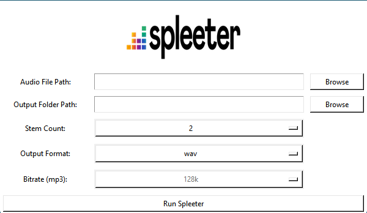

# Spleeter-GUI
A basic GUI for using the Spleeter algorithm to split a music file into individual stems.

So when I'm working on bootlegs in my music production hobby, I find myself using Spleeter
a lot to separate a track into individual stems so that I can have isolated vocals or instruments
to play around with. I like to minimise time spent doing things like this so that I can quickly pivot
back to my DAW and work on ideas, so I decided to throw together a little interface for Spleeter.

This GUI requires Spleeter to already be installed, [which can be found here.](https://github.com/deezer/spleeter/wiki/1.-Installation)

It's not the prettiest, but it does the job!